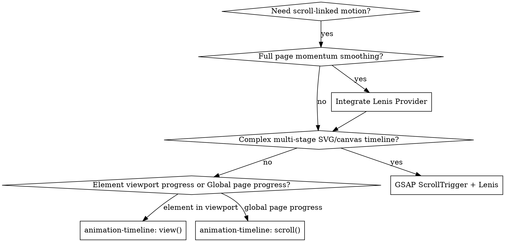

# Scroll-Driven Animations

## Overview

Scroll-driven animations map animation progress directly to scroll distance rather than elapsed time. Instead of scrubbing timelines via heavy JavaScript `scroll` event listeners and layout recalculations, modern scroll-driven animations leverage the native CSS **Animation Timeline API** (`animation-timeline: view()` and `animation-timeline: scroll()`) running hardware-accelerated on the compositor thread at 120fps, paired with **Lenis** for momentum smoothing and progressive enhancement fallbacks.

## When to Use



### Symptoms & Triggers
- Designing scroll-to-reveal cards, sections, or typography.
- Building a reading/scroll progress bar or header elevation on scroll.
- Scrubbing an entrance or exit animation smoothly as the user scrolls.
- Eliminating scroll jank, main-thread stutter, or layout shifts caused by `window.addEventListener('scroll')`.
- Wanting inertia/momentum-smoothed scrolling without hijacking native touch gestures.

### When NOT to Use
- Pure time-based animations (hover, click transitions, loaders) -> use standard CSS transitions or `@keyframes`.
- Sticky navigation without visual state transformations -> use standard CSS `position: sticky`.
- When user has enabled `prefers-reduced-motion: reduce` -> always bypass animations or clamp to final state.

---

## Core Primitives

### 1. View Progress Timeline: `view()`
Tracks an element's journey into, through, and out of the viewport.

```css
@keyframes fadeRise {
  from {
    opacity: 0;
    transform: translateY(30px);
  }
  to {
    opacity: 1;
    transform: translateY(0);
  }
}

.card {
  animation: fadeRise linear both;
  animation-timeline: view();
  /* Starts when top enters bottom of viewport (10%), finishes at lower third (35%) */
  animation-range: entry 10% cover 35%;
}
```

### 2. Scroll Progress Timeline: `scroll()`
Tracks the scroll container's global scroll progress from 0% to 100%.

```css
@keyframes growProgress {
  from { transform: scaleX(0); }
  to { transform: scaleX(1); }
}

.reading-progress-bar {
  position: fixed;
  top: 0;
  left: 0;
  right: 0;
  height: 2px;
  transform-origin: 0 50%;
  animation: growProgress linear;
  animation-timeline: scroll();
}
```

### 3. Linked Timelines: `timeline-scope` & `view-timeline`
Allows one element to drive the animation of another element elsewhere in the DOM.

```css
/* Ancestor declares scope */
.showcase-container {
  timeline-scope: --track-card;
}

/* Element being scrolled defines timeline */
.tracker-item {
  view-timeline: --track-card;
}

/* Sibling or detached element consumes timeline */
.floating-hud {
  animation: hudHighlight linear both;
  animation-timeline: --track-card;
  animation-range: entry 0% exit 100%;
}
```

---

## Animation Range Cheat Sheet

The `animation-range` property determines when 0% and 100% of the keyframe animation execute:

| Range Keyword | Start (0%) | End (100%) | Typical Use Case |
|---|---|---|---|
| `cover` (default) | Top of element enters bottom of viewport | Bottom of element leaves top of viewport | Parallax background / full traversal |
| `entry` | Top of element enters bottom of viewport | Bottom of element clears bottom of viewport | Reveal animations on scroll-in |
| `contain` | Bottom of element enters bottom of viewport | Top of element leaves top of viewport | Animations active only while 100% visible |
| `exit` | Top of element reaches top of viewport | Bottom of element clears top of viewport | Exit animations on scroll-out |
| `entry 10% cover 30%` | 10% after entering bottom edge | 30% through viewport height | **Best practice for scroll reveal** (arrives and rests without disappearing during reading) |

> [!TIP]
> Always include `animation-fill-mode: both` (or `backwards`) so the starting styles (e.g., `opacity: 0`) apply before the element reaches the start trigger.

---

## Progressive Enhancement Architecture

Native CSS Scroll-Driven Animations have ~85%+ global support (Chromium, Edge, Safari 18+). For unsupported browsers (e.g. Firefox stable), use the progressive enhancement pattern:

```css
/* Baseline for all browsers (or fallback via IntersectionObserver) */
.reveal {
  opacity: 0;
  transform: translateY(20px);
  transition: opacity 0.6s cubic-bezier(0.16, 1, 0.3, 1),
              transform 0.6s cubic-bezier(0.16, 1, 0.3, 1);
}
.reveal.in-view {
  opacity: 1;
  transform: translateY(0);
}

/* Enhanced 120fps native GPU compositor scrubbing */
@supports (animation-timeline: view()) {
  @media (prefers-reduced-motion: no-preference) {
    .reveal {
      animation: scrollFadeRise linear both;
      animation-timeline: view();
      animation-range: entry 10% cover 32%;
      transition: none; /* Let CSS timeline scrub directly */
    }
  }
}
```

---

## Lenis Smooth Scrolling Integration

Lenis provides smooth momentum scrolling, normalizing wheel delta across different operating systems and mice without interfering with native touch or accessibility.

### React / Next.js Setup

```tsx
"use client";

import { useEffect } from "react";
import Lenis from "lenis";

export function SmoothScrollProvider({ children }: { children: React.ReactNode }) {
  useEffect(() => {
    // Respect reduced motion preference
    if (window.matchMedia("(prefers-reduced-motion: reduce)").matches) {
      return;
    }

    const lenis = new Lenis({
      duration: 1.15,
      easing: (t) => Math.min(1, 1.001 - Math.pow(2, -10 * t)),
      orientation: "vertical",
      gestureOrientation: "vertical",
      smoothWheel: true,
      touchMultiplier: 1.5,
    });

    function raf(time: number) {
      lenis.raf(time);
      requestAnimationFrame(raf);
    }
    const rafId = requestAnimationFrame(raf);

    return () => {
      cancelAnimationFrame(rafId);
      lenis.destroy();
    };
  }, []);

  return <>{children}</>;
}
```

### Synchronizing Lenis with GSAP ScrollTrigger (When Needed)

If using GSAP alongside Lenis:

```ts
import gsap from "gsap";
import { ScrollTrigger } from "gsap/ScrollTrigger";
import Lenis from "lenis";

gsap.registerPlugin(ScrollTrigger);

const lenis = new Lenis();
lenis.on("scroll", ScrollTrigger.update);

gsap.ticker.add((time) => {
  lenis.raf(time * 1000);
});
gsap.ticker.lagSmoothing(0);
```

---

## Common Mistakes & Solutions

| Mistake | Consequence | Fix |
|---|---|---|
| Omitting `both` or `backwards` fill mode | Element flashes at full opacity before snapping to 0% | Use `animation: name linear both;` |
| Using `cover` for content reveal | Element fades out as soon as it crosses viewport center | Use `animation-range: entry 10% cover 35%;` so it reaches 100% and stays |
| Missing `@supports` check | Non-supporting browsers show blank/hidden content | Gate behind `@supports (animation-timeline: view())` and keep `IntersectionObserver` fallback |
| Ignoring `prefers-reduced-motion` | Causes nausea/vestibular distress for motion-sensitive users | Wrap all motion in `@media (prefers-reduced-motion: no-preference)` |
| Overly dramatic translateY offsets (>50px) | Feels sluggish, disorienting, and disconnects layout | Use subtle translations (14px - 28px) with natural opacity curves |
| Hijacking touch scroll on mobile | Breaks native mobile pinch-zoom and gesture feel | Ensure smooth scroll libraries preserve native touch (`smoothTouch: false`) |
